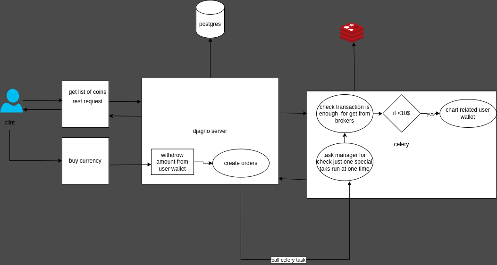

# Buy-cryptocurrency
A simple cryptocurrency purchase system :)

### Overview



The user sends a purchase request for digital currency

## How To Run?
1. clone project
    ```bash
    
    git clone git@github.com:vahidtwo/Aban-tether-task.git
    
    cd buy-cryptocurrency
    ```
2. create env file
   ```bash
   cp .env.example .env
   ```
   - put your environment in to this files
   

3.1 run project using docker
 - **Note**: *You need to have `docker` and `docker-compose` installed.*
    ```bash
    
    
    # run project with docker and docker-compose
    docker compose -f ./docker-compose.yml up -d
    docker exec -it django-aban-tether bash
    python manage.py createsuperuser
    
    ```
3.2 run project with virtualenv
- **Note**: *You need to have `postgres` or other dbms and `redic`.*
    ```bash
    
    virtualenv .venv

    . .venv/bin/activate

    pip install -r requirements.txt

    python manage.py migrate

    python manage.py runserver

    ```

## Document
**To see the project document, after running it, go to the `{server url}/` or
`{server url}/redoc` or `{server url}/schema` path and view the document**
